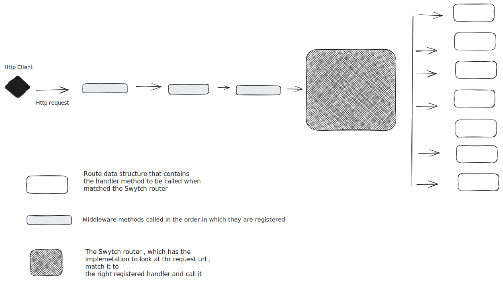

## The Swytch Architecture, Intro
> Devlog 26.06.24

*The Swytch architecture is a request processing pipeline made up of **middleware** functions , the
**Swytch router** and several registered **method refrences** that are dynamically invoked.*

#### An idea for a request processing pipeline

I think it's funny how the decision to write an http router in C# was made minutes after reading about the 
concept of delegates in the language. At first i thought "oh cool, a variable that can hold a method reference" and 
then I continued reading and saw the part about a multicast delegate.
A way you could chain methods(delegates) and invoke them in order. 
>This example demonstrates how to create multicast delegates.
> A useful property of delegate objects is that multiple objects can be assigned to one delegate instance by using the + operator. 
> The multicast delegate contains a list of the assigned delegates.
> When the multicast delegate is called, it invokes the delegates in the list, in order. Only delegates of the same type can be combined.
[more](https://learn.microsoft.com/en-us/dotnet/csharp/programming-guide/delegates/how-to-combine-delegates-multicast-delegates)

First thing that came to mind was a pipeline an http request could travel through. At that point I had
no idea the existence of the amazing and convenient `HttpListener` server class but that didn't matter. If there was a
way to string together methods and have control over the execution sequence... sold! 
So yh , request processing pipeline for `Swytch` containing your middlewares and request handling logic
is basically me multicasting a `Action<Task,RequestContext>` delegate.
